# Vascular-Permeability
Calculation of Vascular Permeability and Patlak Analysis of micro vessels

<h1>Reference  
</h1>

Reyes‐Aldasoro, C. C., Wilson, I. , Prise, V. E., Barber, P. R., Ameer‐Beg, M. , Vojnovic, B. , Cunningham, V. J. and Tozer, G. M. (2008), Estimation of Apparent Tumor Vascular Permeability from Multiphoton Fluorescence Microscopic Images of P22 Rat Sarcomas In Vivo. Microcirculation, 15: 65-79. doi:10.1080/10739680701436350

<h1>Measurement of vascular permeability  
</h1>

The analysis of vascular permeability of tumour blood vessels is of
interest for the treatment of cancer for 3 main reasons. First, the
vascular wall represents a major barrier to the entry of high molecular
weight anti-cancer agents into tumour tissue; second, it controls the
tumour microenvironment thus affecting tumour progression and third,
changes in its barrier function may provide an early indicator of
vascular damage following treatment with anti-angiogenic or vascular
disrupting drugs. Despite these important factors,  tumour vascular
permeability has received little attention in terms of the analytic
measurements.

 
We have developed an image processing-based algorithm (<a href="http://onlinelibrary.wiley.com/doi/10.1080/10739680701436350/abstract">Reyes-Aldasoro, et. al., Microcirculation, 2008</a>) to
measure the vascular permeability of microvessels to
intravenously-administered 40 kDa fluorescein isothiocyanate (FITC)
labelled dextran in tumours. 

 

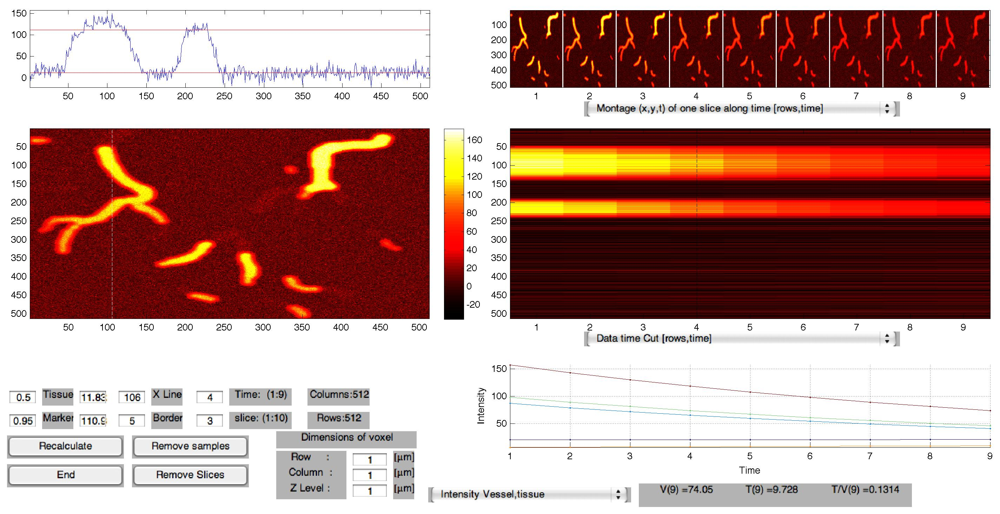

 
 

We have also developed a Graphical User Interface (GUI) that can be used as a visualisation tool for 4-D data and can be used 
to calculate permeability as obtained from Patlak analysis.

 These pages describe the use of the Matlab Graphical User Interface for analysing and visualising four-dimensional permeability data sets. 

<h1>Brief Description of Patlak Analysis</h1>
         
 

         
A Patlak plot (also known as Gjedde–Patlak plot, Patlak–Rutland plot, or Patlak analysis) is a graphical analysis tool 
used to analyse the uptake of substances by biological models (that is a living organism). The substances are normally
tracers, either radioactive or fluorescent, that in a way are retained by the model by some processes. These processes are 
then modelled (in the mathematical way) as the exchange between a series of compartments. This is sometimes called <i>Comparmental Analysis</i>.
The compartments are communicated between each other with links that can be either <b>reversible</b> (the exchange of substances or fluids can flow in both directions) or <b>irreversible</b> (the flow is in one direction only, and then it is <i>trapped</i> inside that compartment).

These compartments can be connected in different ways, for instance, a source of irrigation like the blood plasma can be linked to either a reversible or an irreversible compartment directly:

 

 

However, the compartments are connected among themselves to form a more realistic scenario, for instance a reversible compartment can lead to an irreversible compartment:

 

 
 

The mathematical model of the Blood Brain Barrier (BBB) published by Patlak 
[<a href="http://www.nature.com/jcbfm/journal/v3/n1/abs/jcbfm19831a.html">doi:10.1038/jcbfm.1983.1</a>] 
is a well-established tool for analysing the net irreversible uptake of solutes from plasma to tissue and has been widely used in applications like Magnetic Resonance Imaging (MRI)  and Positron Emission Tomography (PET). 

Patlak modelled the brain tissue as a series of compartments that receive a flow from an irrigation source, namely blood plasma. Some of these compartments have a reversible boundary with the plasma and some have an irreversible boundary. Estimates obtained from Patlak analysis are independent of the number of reversible compartments (and are then modelled as one) with which the solute exchanges before being irreversibly trapped in the tissue (for a time beyond the duration of the experiment). 
  

Patlak presented a graphical method for analysing the behaviour of the model. A graph
of the ratio of intensities 

, (where  and  are the time intensities of the Cvess(t)
extra-vascular tissue and the intra-vascular tissue) versus 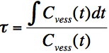 (the abscissa will be and adjusted time, sometimes called <i>stretch time</i> or even <i>funny time</i>) yields a linear relationship (after a certain time t*), with a slope which is an estimate of the rate of irreversible extravasation of the solute (influx constant) Ki	and an ordinate intercept proportional to the fractional volumes of the plasma and reversible compartments. Such a graph has become known as the <b>Patlak plot</b>.
  
 
For example, the slow extravasation of the high molecular weight dextran molecules means that the extravasation can be considered irreversible within the time-course of the experiment. It is important to notice that Ki is essentially a lower bound estimate of the net extravasation, since the movement to the irreversible compartment does not exclude the possibility of reversible movement through the boundary occurring within the boundary class.
The following mathematical model can approximate the points obtained from the adjusted axis: 
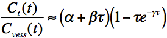, where  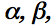 and
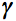 are constants. 

 defines the non-linear section of the model, which only influences at the beginning of the
adjusted time; as 

increases 
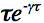
tends to zero. 

  
After this particular

the model becomes linear;

will determine the intercept and 

 will represent the slope equivalent to Ki. If 

tends to zero and the plot tends to a horizontal line, it will imply a small irreversible compartment and therefore a lower tumour vascular permeability. As 

increases, so would the slope of the line, the size of the irreversible compartment and the vascular permeability.

 

 The following figure illustrates several situations of idealised Patlak plots.
Each situation presents two lines representing models with similar conditions. 
<ul>
<li>
In (a) the volume of the reversible compartment is considered negligible, its intercept will be zero 

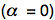,
and the flow from the plasma goes directly into the irreversible compartment. The two lines represent cases with different volumes of the irreversible compartment, i.e. Line 2 has a bigger slope 

bigger irreversible compartment and therefore it represents a higher vascular permeability. 
</li>
<li>
In (b) the volume of the irreversible compartment is now considered negligible

and therefore the slope of both lines will tend to zero. Line 2 is considered to have a larger reversible compartment 

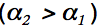.
</li>
<li>
In (c) the two models will have similar reversible compartments different irreversible compartments

, 
 and finally 
 </li>
 <li>
 in (d) the opposite case is presented, similar irreversible compartment volumes with different reversible compartment volumes

.
</li>
</ul>   
  
   

 

   
  

<h1>Reading Permeability Data</h1>
 

The data to be analysed is normally a 4-Dimensional array of
        values, that is, 3-D volumetric z-stacks that are acquired at
        several time points, in that way, the molecules of interest will flow through 
        a region of interest and will have enough time to permeate through the vasculature.
        The data is normally acquired with a multi-photon or confocal microscope that will be tuned to
        capture a fluorophore related to the molecules of interest (Dextran, for instance) as the
        permeability is related to the physical composition of the tissue. In other words, when talking about permeability it has
        to be related to a specific substance.

 

 
<h2>Loading the data into MATLAB from standard image formats (tiff, bmp, etc.)</h2>
 

 The main Graphical User Interface (next section) will allow you to read the data and visualise it directly, but it may be the case
that you want to read the data into matlab before analysing or displaying it.

     There are many ways in
        which the data can be exported from other formats that are
        provided by the proprietary packages that drive Confocal and
        Multiphoton Microscopes. The easiest format to export is as TIFF
        images, and save them as individual images for every z-slice of
        the stack. This will produce one root folder that will contain
        another folder for each time frame. These last folders will
        contain one image for each slice of the z-stack.

If you know the name of the root folder you can pass this as
        the argument for the readPermeability function:

<pre class="codeinput">dataIn=readPermeabilityData('testData');
</pre>
<pre class="codeoutput">Read tiff images from folders and save as matlab data
</pre>

However, you do not need to type the name of the root folder in
        advance, you can type the following command, which will open a
        new window. Select "Multiple Files in a Folder" and navigate to
        select the root folder:

<pre class="codeinput">dataIn=readPermeabilityData();
</pre>
 

 
      

 When you select <b>Multiple files in a folder</b> you have two options, one is to have one folder, which contains several folders 
(one for every time point), and each of these folders contains a series of images (one for every image of a z-stack):
 
      

 

 or one folder with several files, each of which will have multiple images. For example, the <i>PIC</i> biorad format stores each time point in a single file:
 

 You need to select the root folder, that is, the one that contains the other folders or the images, and then continue the process:

      
<pre class="codeoutput">Read tiff images from folders and save as matlab data
</pre>

 Finally, once you have read the data from other formats, you can save it as a single matlab file, which can later be loaded directly.

  
 
 

<h1>Visualising 4D Datasets</h1>
         
 

    
    
         
<h2>PermeabilityAnalysis Graphical User Interface</h2>
 

Once you have loaded the data into a suitable MATLAB format,
        all you need to do is call the graphical user interface created
        by the function PermeabilityAnalysis:

<pre class="codeinput">PermeabilityAnalysis(dataIn);
</pre>

 You can also call it without any parameters and then select the data set as described previously.

 
<h2>Main Interface subwindows</h2>
 

PermeabilityAnalysis has many interesting options. In this section we will cover 
        the visualisation options and in the next one the patlak and numerical analysis.
        
        The default interface has five subwindows: 
        (1) Intensity profile of one vertical line,
        
        (2) Histogram distribution of the data,  
        (3) Intensity display of of one slice at one given time point, 
        (4) Various visualisation options and 
        (5) Time and Patlak intensities. 

      
 

      The data sets will consist of four dimensions (x,y,z,t). Since it is not possible to visualise 
      four dimensional datasets simply, it is possible to select one slice of a 3D-stack at one moment 
      in time, and by changing the time or the z-position it is possible to traverse the data set through the
      four dimensions, to do so, change the values of <b>time</b> and <b>slice</b>. 

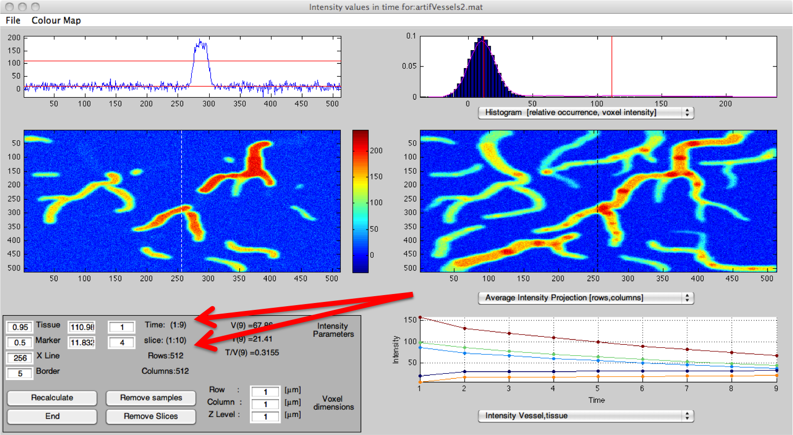

   
        You should see that there is a vertical line overlaid on windows
        (3,4). This correspond to the intensity profile that has been selected to be
        displayed in window (1). This line can be selected with the box
        labelled <b>X Line</b>. The default value will be in the centre of
        the image (256 in this case), but you can change it to any place
        of interest.

 

<h2>Change of thresholds</h2>
 
      

Two thresholds have been used to determine vessels, tissue,
        surface of the vessels and areas of uncertainty (please refer to
        Reyes-Aldasoro et. al. for further details). These thresholds
        appear in the histogram and the intensity profile in windows (1,2)
        as red lines. They are automatically set to be at 50% and 95% of
        the intensity distribution and they can be manually adapted for
        a more accurate segmentation of the vessels and the tissue. To
        change the values, you can change the percentage (left box) or
        the absolute (right box) for the tissue and the vessels
        (marker). Once you write a new value, the box will change colour
        and will wait until the button <b>Recalculate</b> is clicked to
        obtain all the new values. The boxes will turn their background colour
        from white to cyan one the new value has been selected, and return to
        white once that the analysis has been re-calculated.

 
<h2>Change of colourmap</h2>
 

The default colourmap uses dark blue for low values and
        red-brown for higher values, this is called <b>jet</b> in MATLAB, but
        you can select many other options from the tab on the top left
        (red arrow). 

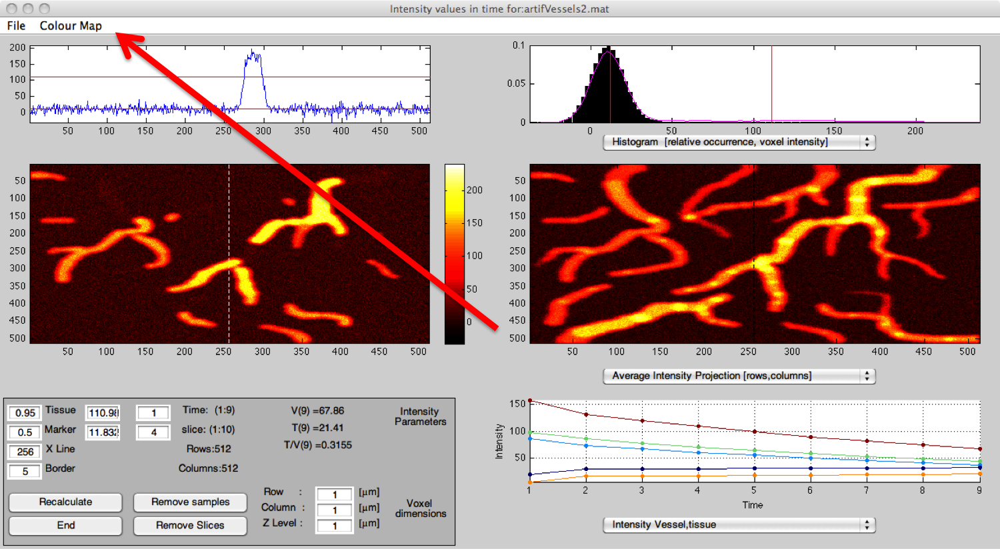

 
<h2>Montages of the data</h2>
 

     In some cases, it is illustrative to visualise three dimensional data as <b>montages</b>, these are 
     composite images where images are cut along one dimension are joined together in a 2D display. Subwindow (1)
     has two options for montages:  one 3D volume (x,y,z) and one slice over time (x,y,t).
     
     In the first option, it is possible to see through the planes of a z-stack:

     
The second option allows to see the changes that the data presents as a function of time:

     

 In both cases, the montages will have the same colour map as the one from subwindow (3).

	
 
	

<h2>Visualisation options</h2>
 

 There are many visualisation option that can be selected in subwindow (4) from the drop-down menu.

      

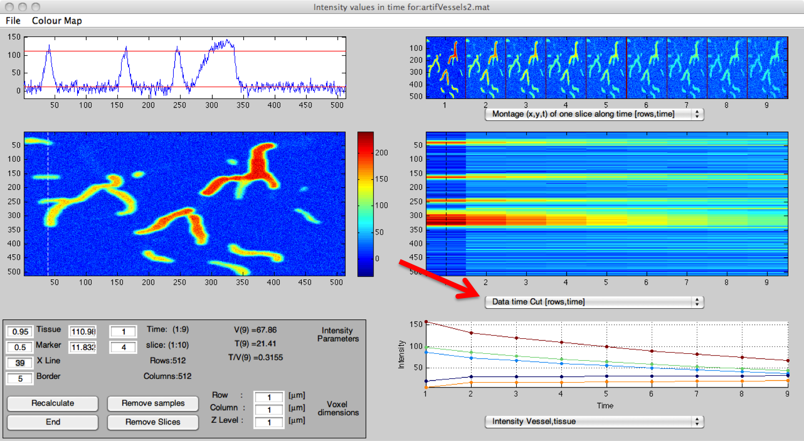

  
      
<ul>
<li>Class mask [rows,columns] : displays one slice of the data as classified with the 
        double threshold segmentation algorithm. Brown = vessels with fluorescent marker, orange
        = tissue, dark blue = area of uncertainty, green and cyan =
        surface of vessels (note, these colours correspond to the jet colourmap, they will change with
        other colour maps).
</li>
   

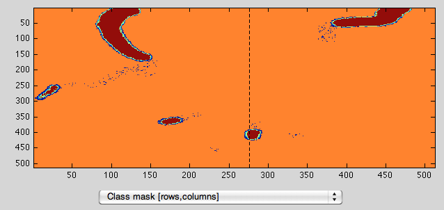

        
   

<li>Mask Volume Cut [rows,z position] : displays the mask with the
          classes as the projection down the z-stack that is, the
          horizontal axis denotes the depth of the z-stack and the
          vertical axis corresponds to one column of the data, the column selected with the 
          profile.</li>
   

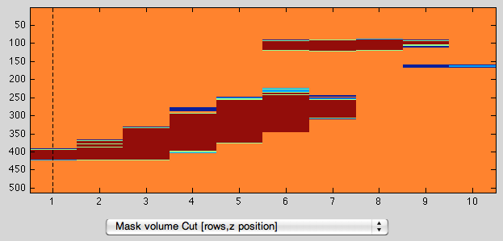

   

<li>Data Volume Cut [rows,z position] : displays the intensity of the
          data with the classes as the projection down the z-stack that
          is, the horizontal axis denotes the depth of the z-stack and
          the vertical axis  corresponds to one column of the data, the column selected with the 
          profile.
          This projection is useful to observe how the data changes down
          the z-stack.</li>

   

   

<li>Data Time Cut [rows,time] : displays the intensity of the
          data with the classes as the projection along the time, that
          is, the horizontal axis denotes the time of the acquisition
          and the vertical axis corresponds to one column of the data, the column selected with the 
          profile. This projection is useful to observe how the data
          changes with time as it is easy to see the vessels/tissue that
          increase or decrease the intensity.</li>
   

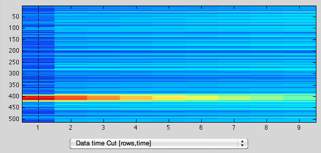

        
   
			
<li>
          Volume Projection [rows, columns]: average intensity projection: all the
		  slices of the z-stack are projected into a single slice. This is useful
		  to visualise the whole 3D volume at once.
</li>
   

    
   

<li>
          Z-stack Intensity [rows, columns, z position]: opens a new window where the slices of a single time point are
          displayed on a stack. Each slice is slightly transparent so it is possible to see through the volume.
           This can be rotated to analyse the vessels.
</li>
        			   

    
   

<li>Vessels (3D) [rows, columns, z position]: opens a new window where the vessels are
          plotted as a cloud of points. This can be rotated to analyse
          the vessels as a volume.</li>

   

    
   

<li>Boundary (3D) [rows, columns, z position]:  same as above but only the boundary is
          plotted, this is useful to visualise the lumen of large
          vessels.
</li>
   

    
   
<li>
          3D Time Projection [rows, columns, z position]: opens a new window where the slices of a single slice 
          at different time points  are
          displayed on a stack with the time on the z axis. Each slice is slightly transparent so it is possible to see through the volume.
           This can be rotated to analyse the change in the  vessels with time.
</li>

   

  
   
</ul>

<h1>Using Patlak Analysis</h1>

    

All the previous commands are used to visualise the data. The
commands that analyse the data in a quantitative way are
displayed in subwindow (5) and changed with the drop-down menu in
the centre bottom. The default plot will show the
intensity of all the classes: vessels (brown), tissue (orange),
uncertain (dark blue) and boundaries (green, cyan). These
colours correspond to the masks previously explained (when using jet colour map). You can
plot several combinations of the classes, perhaps the most
useful is vessels and tissue. You can also select tissue/vessel
which shows the increase of the tissue against the vessels with
time.

When you select different plots, the values displayed within the frame will change accordingly:

 

    
 

    
<h2>Setting the thresholds</h2>

    

One important part of the analysis process is the determination of suitable thresholds. The thresholds
are set to discriminate the background (a low threshold), and the vessels (a high threshold). Whatever is
not below the low threshold or above the high threshold will be initially an uncertainty region, but if it is
close to the vessels, it will be considered as boundary region of the vessels.

Since the calculation of the patlak plot is time consuming (a few seconds), this is not done automatically when 
setting the thresholds. Instead, when modifying the threshold values, the background of the box will change colour 
to indicate that the value has been modified. You can then re-calculate the values of the patlak analysis or you can
select another value to change, for instance the other threshold or the size of the border that surrounds the vessels.

  

    
    
 

    

 When you click recalculate, the changes will be reflected in the threshold lines in subwindows (1,2) and also

    
in (4) if you select the <b>Class Mask</b> option from the drop-down menu:

 
  

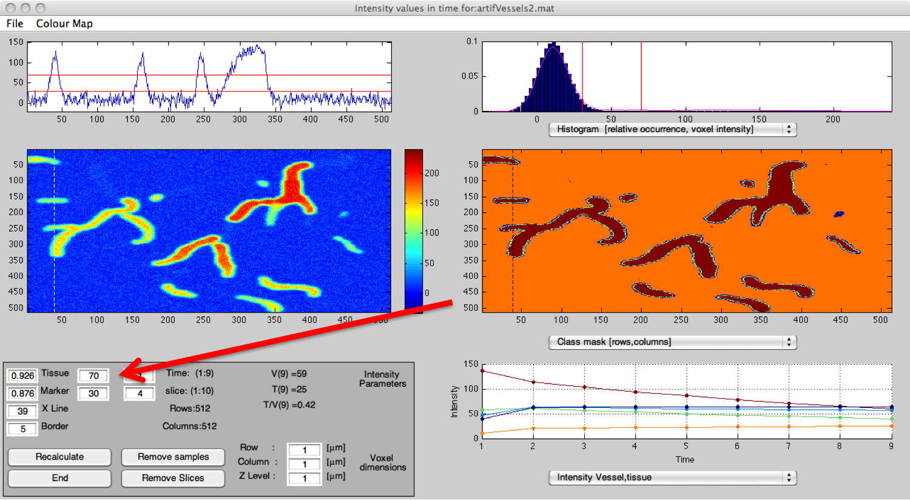

    
    
 

 The values of the thresholds in relative [0-1] and absolute terms [0- ] will be automatically updated, together with
     the patlak and intensity values and curves.

    

    
<h2>Patlak Plots</h2>

    

The main quantitative comparison will be obtained from the traditional Patlak analysis. A three compartment model has been
used to model the exchange of blood as in the classical blood-brain barrier analysis (refer to Reyes-Aldasoro et. al. for more details). The points of the plot and the adjusted line are plotted together. The values of the patlak model, k1, k2,
k4, P and PS/V are displayed under window (5).

  

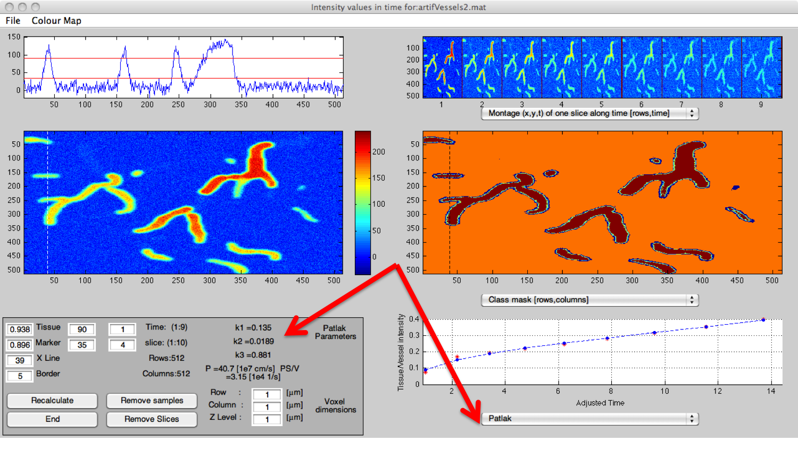

    
    
 

    

 Once you have finished all the analysis, you can close the figure. A new MATLAB variable called <b>data</b> will have been produced.
 This variable contains all the data, the original intensity data, the thresholds used, the class mask, etc. Save this file with 
 the name you choose in case you are interested in consulting the results later.

    

    

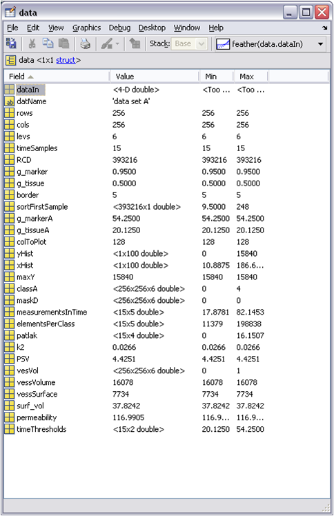

    

    

 

    

 
<h3 style="margin-left: 40px;">Synthetic Data for Vascular Permeability Analysis </h3>

 

Every set of algorithms has to be validated, either against a hand-labelled gold standard or a synthetic data, where the ground truth is known.

Two synthetic data sets that reproduce different permeability characteristics were generated in MATLAB. Both had the same number of vessels, that covered a matrix of 512 x 512 x 10 voxels, which spread over 9 time frames. The vessels had different diameters and the intensity decreased as the diameter became thinner to simulate real capillary networks. The intensity of the surrounding voxels (tissue) was lower than that of the vessels and as time increased, one of them had a higher intensity of the tissue than the other, thus simulating the increase in permeability, as measured by the Patlak measurements.

 

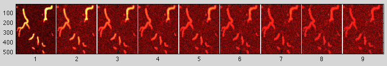

 
 

The datasets are large matlab files (180MB aprox.) and can be accessed through the following links:

<ul>
<li>

<pre class="codeinput">artifVessels1.mat</pre>
<a href="http://phagosight.org/SynData/artifVessels1.mat">http://phagosight.org/SynData/artifVessels1.mat</a>

First data set

(less permeable)  </li>
<li>

<pre class="codeinput">artifVessels2.mat</pre>
<a href="http://phagosight.org/SynData/artifVessels2.mat">http://phagosight.org/SynData/artifVessels2.mat</a>
Second data set

(more permeable) </li>
</ul>

The ground segmentation for the vessels is available as well  in Matlab format:

<ul>
<li>

<pre class="codeinput">artifVessels3.mat</pre>

Ground Truth

</li>
</ul>

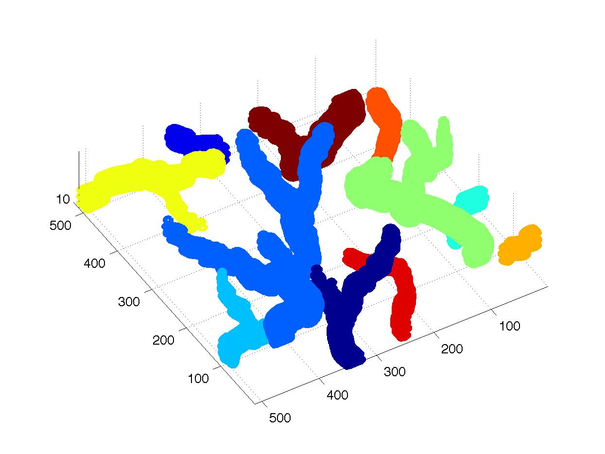

